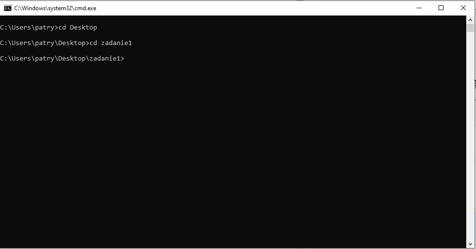
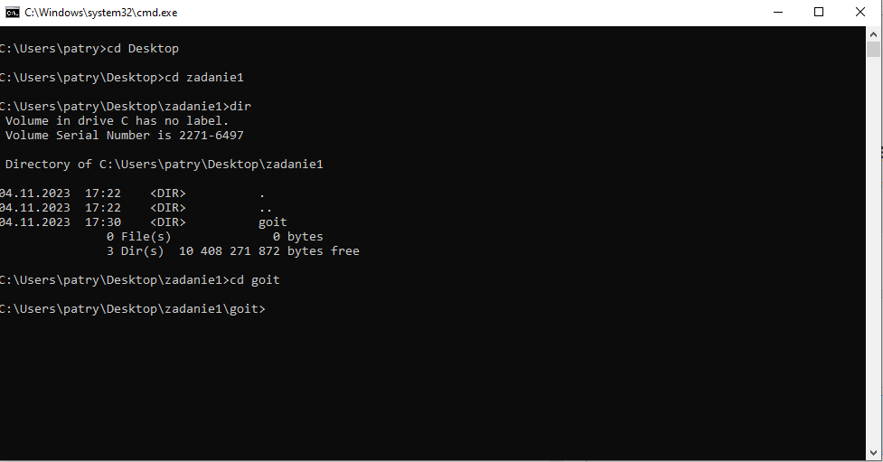
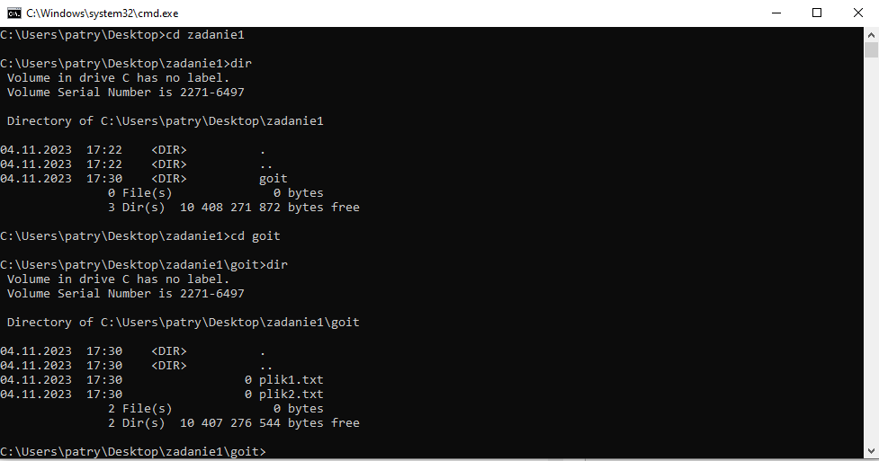
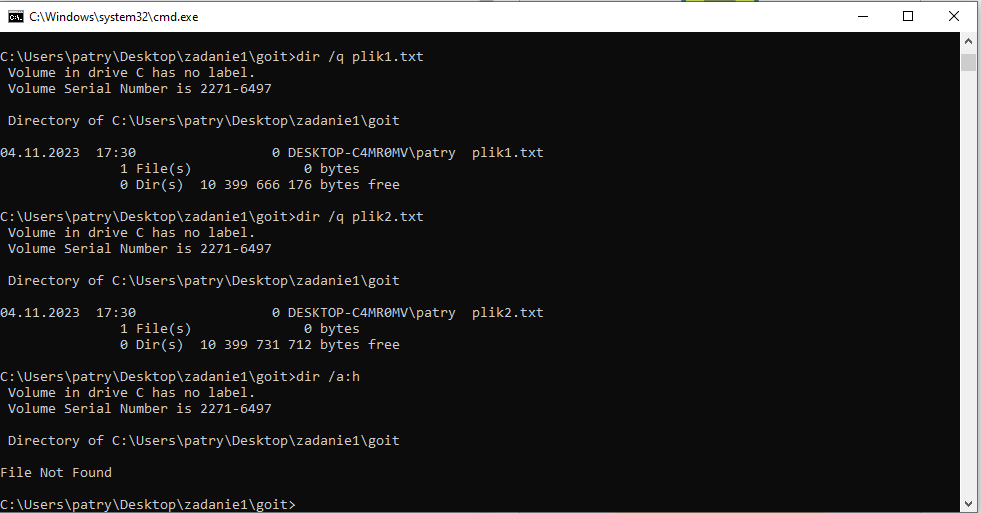
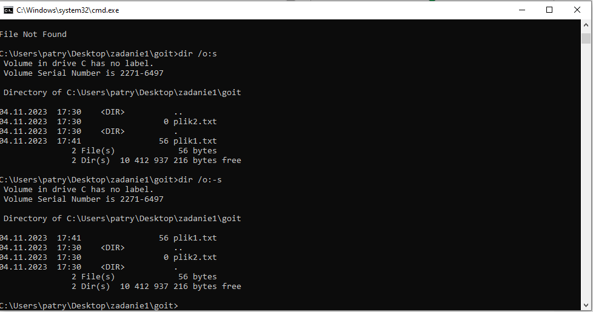

1. Przejdź do dowolnego katalogu, w którym znajduje się co najmniej jeden podkatalog. 

Navigate to any directory that contains at least one subdirectory.

 

2.Wyświetl listę plików/folderów w tym katalogu, a następnie wybierz jeden folder w bieżącym katalogu roboczym.

Display a list of files/folders in this directory, and then select one folder in the current working directory.

 

3.Wyświetl listę plików w wybranym folderze podrzędnym.

Display a list of files in the selected subfolder.

 

4.Wyświetl ponownie jego zawartość, tym razem jednocześnie wyświetlając: 

 

  4.a. informacje o właścicielu każdego pliku 
  
 

 4.b. wszystkie ukryte pliki.

 

 Display its contents again, this time displaying at the same time:

 4.a. information about the owner of each file

 4.b. all hidden files.

 

 5. Wyświetl listę plików w bieżącym katalogu roboczym, POSORTOWANĄ według rozmiaru plików wewnątrz:

 

 5.a. od najmniejszego do największego rozmiaru 

 

 5.b. od największego do najmniejszego rozmiaru. 

 

Display a list of files in the current working directory, POSORTED by the size of the files inside:

 5.a. from smallest to largest size

 5.b. od największego do najmniejszego rozmiaru.

